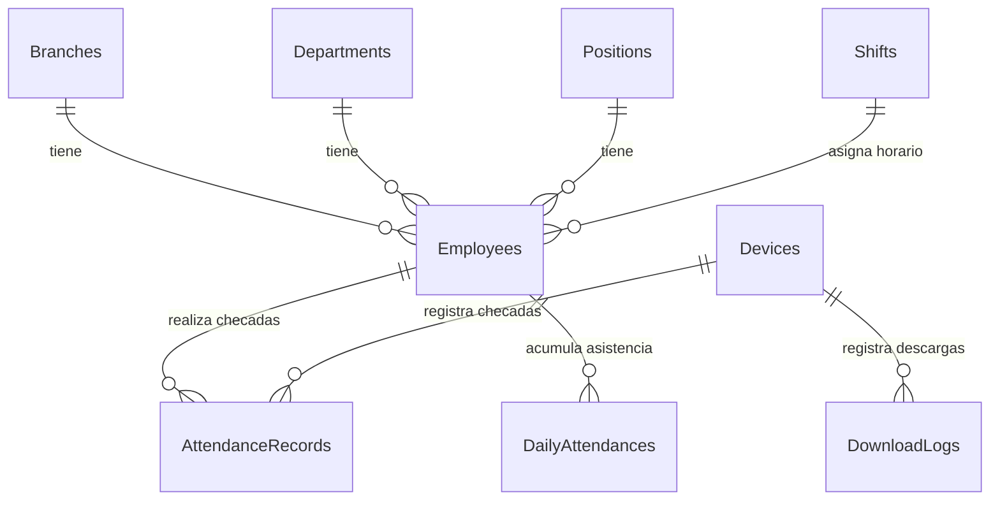

# 📘 Manual Técnico - Attendance System

Este documento proporciona la información técnica necesaria para desarrolladores, administradores de sistemas y equipos de TI encargados de desplegar, mantener y dar soporte a la aplicación **Attendance System**.

---

## 1. Arquitectura del Sistema

El sistema de asistencia está diseñado bajo una arquitectura de **Clean Architecture** (Arquitectura Limpia) y desacoplado en dos aplicaciones independientes que se comunican de manera segura a través de **gRPC**:

1. **AttendanceSystem.Blazor.Server (x64):** La aplicación web principal encargada de la interfaz de usuario (construida con MudBlazor), lógica de negocio, reportes y persistencia de datos. Se ejecuta en 64 bits para maximizar el rendimiento.
2. **AttendanceSystem.ZKTeco.Service (x86):** Un Servicio de Windows que actúa como bridge de comunicación con el hardware. Se ejecuta exclusivamente en **32 bits (x86)** debido a que las librerías nativas del SDK de ZKTeco (`zkemkeeper.dll`) no disponen de soporte para arquitecturas de 64 bits.

### 1.1 Diagrama de Arquitectura de Comunicación

```mermaid
graph TD
    subgraph Cliente ["Capa Cliente / Navegador"]
        UserBrowser["Navegador Web (Chrome, Edge, Firefox)"]
    end

    subgraph Servidor ["Servidor de Aplicación (Windows Server / Windows 10/11 Pro)"]
        subgraph BlazorApp ["AttendanceSystem.Blazor.Server (x64)"]
            UI["Capa de Presentación (MudBlazor)"]
            AppLogic["Capa de Aplicación (MediatR, Use Cases)"]
            Infra["Capa de Infraestructura (EF Core)"]
            Hangfire["Hangfire (Tareas en Background)"]
        end

        subgraph WinService ["AttendanceSystem.ZKTeco.Service (x86)"]
            gRPCServer["Servidor gRPC (HTTP/2)"]
            ZKSdk["SDK Adaptador ZKTeco (COM / zkemkeeper.dll)"]
        end

        subgraph DB ["Motor de Base de Datos"]
            Postgres["PostgreSQL 16.x"]
        end
    end

    subgraph Dispositivos ["Relojes Checadores (LAN/WAN)"]
        ZKClock["Reloj ZKTeco (Puerto 4370)"]
        HikClock["Reloj Hikvision (Puerto 80/ISAPI)"]
    end

    UserBrowser -->|HTTP/HTTPS (Puerto 8081 / 80)| UI
    Infra -->|EF Core / Npgsql| Postgres
    Hangfire -->|Cola de Descarga| Infra
    AppLogic -->|Cliente gRPC (Puerto 5001 - HTTP)| gRPCServer
    gRPCServer -->|Llamadas SDK x86| ZKSdk
    ZKSdk -->|Protocolo UDP/TCP (Puerto 4370)| ZKClock
    Infra -->|Llamadas directas HTTP/JSON (ISAPI)| HikClock
```

### 1.2 Flujo de Datos

#### Registro y Prueba de Dispositivo
1. El usuario administrador registra el reloj checador en la interfaz web de Blazor ingresando la dirección IP, puerto, marca (`ZKTeco` o `Hikvision`) y método de descarga (`Sdk` o `Adms`).
2. El sistema persiste la configuración en la tabla `Devices` de la base de datos PostgreSQL.
3. Al presionar **Conectar / Probar Conexión**:
   - Si es **ZKTeco (SDK)**: La app Blazor envía una solicitud gRPC al servicio `AttendanceSystem.ZKTeco.Service` especificando la IP y puerto. El servicio carga las DLLs nativas de 32 bits, abre un canal TCP/IP al puerto 4370 del reloj, valida la conexión y retorna el estado.
   - Si es **Hikvision (ISAPI)**: La app Blazor realiza una petición HTTP/HTTPS (REST) directa al endpoint `/ISAPI/System/deviceInfo` del reloj. Si responde con código 200 OK y las credenciales son válidas, confirma la conexión.

#### Sincronización y Descarga de Asistencias (Flujo PULL)
1. **Programador de Tareas (Hangfire)** o un operador web dispara la acción de descarga.
2. El sistema lee las credenciales e IP del dispositivo desde la base de datos.
3. Se invoca el método correspondiente:
   - Para ZKTeco: Llamada gRPC `GetAttendanceLogs` $\rightarrow$ Conexión del SDK x86 al hardware $\rightarrow$ Retorno de DTOs con registros crudos $\rightarrow$ Guardado en Blazor.
   - Para Hikvision: Petición HTTP GET a `/ISAPI/AccessControl/AcsEvent` $\rightarrow$ Deserialización de JSON/XML $\rightarrow$ Guardado en Blazor.
4. La capa de aplicación procesa las asistencias crudas, ejecuta el motor de reglas de horarios y guarda los resultados calculados en `DailyAttendances` y las checadas crudas en `AttendanceRecords`.

---

## 2. Requisitos Técnicos

Para garantizar el correcto funcionamiento del sistema, el entorno de despliegue debe cumplir con las siguientes especificaciones:

### 2.1 Requisitos del Servidor (Hosting)

| Componente | Requisito Mínimo | Requisito Recomendado |
| :--- | :--- | :--- |
| **Arquitectura de CPU** | Procesador x64 de 2 nucleos a 2.0 GHz | Procesador x64 de 4 nucleos o superior |
| **Memoria RAM** | 8 GB | 16 GB |
| **Almacenamiento** | 20 GB de espacio libre (SSD recomendado) | 50 GB de espacio libre (SSD NVMe) |
| **Sistema Operativo** | Windows 10/11 Pro (64-bit) | Windows Server 2019/2022 Standard |
| **Puertos de Red Abiertos**| **8081** (Web Self-Hosted), **5001** (gRPC Service) | **80/443** (IIS Web), **5001** (gRPC local), **5432** (PostgreSQL) |

### 2.2 Requisitos de Conectividad (Red)
* **Puertos de Dispositivos (Entrada/Salida):**
  * **Puerto 4370 (TCP/UDP):** Puerto por defecto utilizado por los relojes ZKTeco para la comunicación vía SDK.
  * **Puerto 80 / 443 (TCP):** Utilizado por los relojes Hikvision para la comunicación vía ISAPI HTTP/HTTPS.
* **Segmentación:** Se recomienda que los relojes checadores estén en la misma subred (LAN) o comunicados mediante una VPN estable (WAN) con el servidor.

### 2.3 Requisitos del Cliente (Usuario Final)
* **Navegador Web:** Google Chrome (v110+), Microsoft Edge (v110+), Mozilla Firefox (v115+).
* **Resolución de pantalla:** Mínima de 1280x720 (diseño responsive compatible con pantallas táctiles y tabletas).

### 2.4 Software y Runtimes Requeridos
* **PostgreSQL:** Versión mínima 14.x. Versión recomendada **16.x (x64)**.
* **.NET Runtime:** ASP.NET Core Hosting Bundle **9.0.x** (necesario si se utiliza la opción de despliegue en IIS).

---

## 3. Instalación y Despliegue con Inno Setup

El despliegue en producción se realiza mediante un instalador único compilado con Inno Setup (`AttendanceSystem_Setup.exe`), el cual automatiza toda la configuración del servidor.

### 3.1 Pre-instalación
1. Descargue el instalador y ejecútelo con **permisos de Administrador** (clic derecho $\rightarrow$ *Ejecutar como administrador*).
2. El instalador detectará si los siguientes prerrequisitos ya se encuentran en el sistema:
   * **PostgreSQL:** Comprueba los registros en `SOFTWARE\PostgreSQL\Installations`.
   * **ASP.NET Core Hosting Bundle:** Comprueba los registros en `SOFTWARE\Microsoft\ASP.NET Core\Shared Framework\v9.0`.
   * Si falta alguno de los dos, el instalador procederá a ejecutarlos de forma desatendida desde sus instaladores temporales.

### 3.2 Paso a Paso de la Ejecución del Instalador
1. **Selección de Idioma:** Ventana emergente inicial para configurar el instalador en idioma Español.
2. **Pantalla de Bienvenida:** Presentación del asistente de instalación de *Attendance System [VERSION]*.
3. **Selección de Carpeta de Destino:** Por defecto se establece `C:\Program Files\AttendanceSystem`.
4. **Selección de Tareas Adicionales:**
   * checkbox **Configurar como servidor IIS:** Seleccione esta opción si está instalando en un Windows Server corporativo y desea que la aplicación Blazor se aloje dentro del Internet Information Services local en el puerto 80. Si no se marca, funcionará de manera independiente (Kestrel) en el puerto 8081.
5. **Detección e Ingreso de Credenciales de BD:**
   * Si el instalador detecta que **ya existe** una instancia de PostgreSQL local, desplegará una pantalla personalizada solicitando ingresar la contraseña del superusuario `postgres` para poder configurar los esquemas y privilegios del sistema.
   * Si **no existe**, instalará PostgreSQL de forma desatendida usando la contraseña maestra por defecto `Blanquita.123`.
6. **Progreso de Instalación:**
   * Descompresión de archivos de la aplicación y el servicio.
   * Ejecución en segundo plano del instalador de PostgreSQL (`postgresql-installer.exe --mode unattended`).
   * Ejecución del Hosting Bundle de .NET 9 (`dotnet-hosting.exe /install /quiet /norestart`).
   * Registro del SDK ZKTeco en Windows (`regsvr32.exe /s zkemkeeper.dll` tanto en `System32` como en `SysWOW64` para entornos de 64 bits).
   * Creación del Servicio de Windows mediante `sc.exe create AttendanceSystem.ZKTeco.Service`.
   * Configuración de la base de datos llamando a `configure_db.bat`.
   * Apertura de los puertos 8081 y 5001 en el Firewall de Windows Defender.
7. **Pantalla de Finalización:** Opción de arrancar el servicio de forma inmediata y abrir el navegador para el acceso inicial.

### 3.3 Configuración Automática Realizada por el Instalador

El instalador realiza las siguientes tareas críticas en el sistema operativo:

* **Estructura de Directorios:**
  * `{app}\Web`: Archivos de publicación de la aplicación Blazor Server.
  * `{app}\Service`: Archivos del Windows Service de ZKTeco (compilado en x86 autocontenido).
  * `{app}\Database`: Scripts de creación de base de datos e inicialización.
  * `{app}\Logs` y `{app}\Backups`: Carpetas dedicadas a logs históricos y respaldos.
* **Configuración de PostgreSQL:**
  * Se crea un rol/usuario de base de datos exclusivo llamado `attendancesystem_user` con contraseña `Blanquita.123`.
  * Se crea la base de datos `"AttendanceSystem"`.
  * Se otorgan todos los privilegios sobre el esquema `public` y el esquema `hangfire` a dicho usuario.
* **Instalación del Windows Service:**
  * Registra el servicio `AttendanceSystem.ZKTeco.Service` con el comando:
    ```cmd
    sc.exe create AttendanceSystem.ZKTeco.Service binPath= "C:\Program Files\AttendanceSystem\Service\AttendanceSystem.ZKTeco.Service.exe" start= auto displayname= "Attendance System ZKTeco Service"
    ```
  * Inicia automáticamente el servicio.
* **Configuración de IIS (Si aplica):**
  * Ejecuta `enable_iis.ps1` que activa el rol de IIS en Windows con soporte para WebSockets y ASP.NET Core module.
  * Ejecuta `configure_iis.bat` que crea un AppPool dedicado e independiente (`AttendanceSystem`) y un sitio web asignado al puerto 80 apuntando a la carpeta `{app}\Web`.

### 3.4 Post-instalación y Verificación
Para validar que la instalación fue exitosa:
1. Abra una terminal de PowerShell como administrador y ejecute el script de diagnóstico del sistema:
   ```powershell
   & "C:\Program Files\AttendanceSystem\Tools\Diagnose-AttendanceSystem.ps1"
   ```
2. Verifique que los servicios de Windows estén en ejecución:
   ```powershell
   Get-Service "postgresql-x64-16"
   Get-Service "AttendanceSystem.ZKTeco.Service"
   ```
3. Abra el navegador web e ingrese a `http://localhost:8081` (o `http://localhost` si configuró IIS).
4. Inicie sesión con las credenciales maestras por defecto:
   * **Usuario:** `admin`
   * **Contraseña:** `Admin123!`

### 3.5 Desinstalación
Al desinstalar la aplicación desde el panel de control:
* Se detiene y se elimina el servicio `AttendanceSystem.ZKTeco.Service`.
* Se remueven los registros COM del SDK de ZKTeco.
* Se eliminan las reglas de firewall y las configuraciones de IIS (AppPool y sitio web).
* **⚠️ ATENCIÓN:** El instalador **no** borra la base de datos PostgreSQL en PostgreSQL ni elimina la carpeta de backups para resguardar la información histórica de la empresa ante desinstalaciones accidentales. Si requiere una limpieza absoluta, deberá borrar manualmente la base de datos desde pgAdmin.

---

## 4. Configuración de la Base de Datos (PostgreSQL)

El sistema utiliza **PostgreSQL** para toda su persistencia, empleando Entity Framework Core en la capa de infraestructura con migraciones de base de datos autogestionadas.

### 4.1 Esquema de Base de Datos (Tablas Clave)

El esquema de base de datos se distribuye en las siguientes entidades principales:



#### Descripción de las Tablas Principales:
* **AspNetUsers / AspNetRoles / AspNetUserRoles:** Tablas de ASP.NET Core Identity que gestionan las credenciales, nombres completos, estado activo y roles de los operadores del sistema.
* **Branches (Sucursales):** Almacena las sucursales físicas (para configuraciones semi multi-empresa).
* **Departments (Departamentos):** Estructura organizacional de la empresa (Ventas, Sistemas, RH, etc.).
* **Positions (Puestos):** Puestos de trabajo asignados a los empleados.
* **Employees (Empleados):** Tabla núcleo del sistema. Contiene los datos personales del empleado, número de empleado, huellas digitales serializadas en formato JSON/Base64 (`EmployeeFingerprint`), cara enrolada (`FaceTemplate`), número de tarjeta física (`CardNumber`), sucursal, departamento, puesto y el identificador de su horario asignado (`ScheduleId`).
* **Shifts (Turnos / Horarios):** Define la hora de entrada (`StartTime`), hora de salida calculada mediante las horas de trabajo (`WorkHours`), minutos de tolerancia (`ToleranceMinutes`) y el tipo de turno (fijo, rotativo, etc.).
* **Devices (Dispositivos / Relojes):** Configura los relojes físicos. Registra la IP, puerto (por defecto 4370), marca (`ZKTeco` o `Hikvision`), método de sincronización, credenciales de administración del reloj (`Username` y `Password`) y el estado actual de conexión (`Online`, `Offline`, `Error`).
* **AttendanceRecords (Checadas Crudas):** Registro directo descargado de los relojes. Guarda el ID de empleado, fecha y hora de la checada (`Timestamp`) y el tipo de checada (Entrada, Salida, etc.).
* **DailyAttendances (Asistencias Diarias Calculadas):** Tabla generada por el motor de cálculo diario de nómina. Registra por cada empleado y día: hora exacta de entrada, hora de salida, minutos de retraso, horas extras calculadas y autorizadas, y estado de la incidencia (Asistencia, Falta, Retardo, etc.).
* **DownloadLogs:** Auditoría de cada descarga realizada (usuario, cantidad de registros obtenidos, errores detectados).
* **SystemAlerts:** Alertas internas generadas por el sistema cuando ocurren desconexiones de hardware o errores en segundo plano.

### 4.2 Migraciones y Actualizaciones de Esquema
El sistema aplica las migraciones de Entity Framework Core de forma automática en el arranque de la aplicación Blazor:
```csharp
// Program.cs
using (var scope = app.Services.CreateScope())
{
    var dbContext = scope.ServiceProvider.GetRequiredService<AttendanceDbContext>();
    await dbContext.Database.MigrateAsync();
}
```
Para realizar una migración manual desde la consola de desarrollo de .NET:
```powershell
dotnet ef database update --project src/Infrastructure/AttendanceSystem.Infrastructure --startup-project src/Presentation/AttendanceSystem.Blazor.Server
```

### 4.3 Respaldos Automatizados de PostgreSQL (pg_dump)
Se proporciona un script automatizado para programar tareas de respaldo diarias a través del Programador de Tareas de Windows.

**Comando de respaldo diario:**
```cmd
@echo off
set PGPASSWORD=Blanquita.123
"C:\Program Files\PostgreSQL\16\bin\pg_dump.exe" -h localhost -p 5432 -U attendancesystem_user -F c -b -v -f "C:\Program Files\AttendanceSystem\Backups\AttendanceSystem_Backup_%date:~10,4%%date:~4,2%%date:~7,2%.backup" "AttendanceSystem"
```

### 4.4 Restauración de la Base de Datos
Para restaurar un respaldo en caso de fallo catastrófico:
```cmd
set PGPASSWORD=Blanquita.123
"C:\Program Files\PostgreSQL\16\bin\pg_restore.exe" -h localhost -p 5432 -U attendancesystem_user -d "AttendanceSystem" --clean --verbose "C:\Program Files\AttendanceSystem\Backups\nombre_archivo.backup"
```

### 4.5 Tareas de Mantenimiento de BD
Se sugiere ejecutar una tarea programada semanal en PostgreSQL para optimizar índices y liberar espacio muerto:
```sql
-- Ejecutar en pgAdmin o psql
VACUUM ANALYZE;
REINDEX DATABASE "AttendanceSystem";
```

---

## 5. Integración con Relojes Checadores

La integración con dispositivos biométricos soporta dos tecnologías diferentes:

### 5.1 Comunicación vía ZKTeco (SDK Windows Service x86)
* **Librerías Utilizadas:** SDK COM oficial de ZKTeco (`zkemkeeper.dll` y dependencias auxiliares).
* **Servicio Windows:** `AttendanceSystem.ZKTeco.Service` expone un servidor gRPC en el puerto `5001` local.
* **Estrategias de Comunicación:**
  * **SDK (PULL):** El sistema inicia peticiones TCP directas de descarga al puerto 4370 de los relojes de forma síncrona.
  * **ADMS (PUSH):** Los dispositivos envían la información de manera proactiva al servidor web a través del protocolo HTTP ADMS (el reloj checador actúa como cliente enviando peticiones POST al servidor Blazor configurado como servidor ADMS).

### 5.2 Comunicación vía Hikvision (REST ISAPI HTTP)
* A diferencia de ZKTeco, los dispositivos Hikvision no requieren DLLs de 32 bits ni gRPC local.
* **Librerías Utilizadas:** Se utiliza un cliente HTTP estándar (`HttpClient`) integrado de forma directa en el servidor de Blazor Server (x64).
* **Protocolo ISAPI:** La comunicación se efectúa enviando comandos REST con payloads en formato XML o JSON.
  * **Endpoint para información del dispositivo:**
    `GET http://{IP_RELOJ}/ISAPI/System/deviceInfo`
  * **Endpoint para descarga de eventos/asistencia:**
    `POST http://{IP_RELOJ}/ISAPI/AccessControl/AcsEvent?format=json`
    *(Requiere cabecera de autenticación Basic o Digest configurada con las credenciales registradas del dispositivo)*.

### 5.3 Mapeo y Sincronización Bi-direccional
* **Descarga de Asistencias:** El servicio lee los registros crudos del reloj, los formatea a un DTO unificado `RawAttendanceRecord` y limpia la memoria del reloj si la opción `ShouldClearAfterDownload` está activa.
* **Carga de Empleados:** Se envían los nuevos empleados creados en la web hacia los relojes usando el método `RegisterEmployee`, sincronizando el número de ID del empleado, el nombre y el privilegio del dispositivo (Usuario o Administrador).

### 5.4 Manejo de Errores de Conexión
* Si una conexión falla, el sistema realiza hasta 3 intentos de reconexión con un intervalo de 5 segundos de espera.
* Si el reloj sigue inaccesible, se cambia su estado en la base de datos a `Error`, se registra el log con detalles del fallo, y se dispara una alerta visual en el dashboard principal mediante la tabla `SystemAlerts`.

---

## 6. API y Servicios Internos

### 6.1 Endpoints del gRPC ZKTeco Service
El servicio Windows `AttendanceSystem.ZKTeco.Service` define el siguiente contrato en su archivo `.proto`:

```protobuf
syntax = "proto3";

option csharp_namespace = "AttendanceSystem.ZKTeco.Service.Grpc";

service ZKTecoService {
  rpc ConnectDevice(ConnectDeviceRequest) returns (ConnectDeviceResponse);
  rpc GetAttendanceLogs(GetAttendanceLogsRequest) returns (GetAttendanceLogsResponse);
  rpc ClearDeviceLogs(ClearDeviceLogsRequest) returns (ClearDeviceLogsResponse);
  rpc DisconnectDevice(DisconnectDeviceRequest) returns (DisconnectDeviceResponse);
  rpc GetDeviceInfo(GetDeviceInfoRequest) returns (GetDeviceInfoResponse);
  rpc RegisterEmployee(RegisterEmployeeRequest) returns (RegisterEmployeeResponse);
  rpc DeleteEmployee(DeleteEmployeeRequest) returns (DeleteEmployeeResponse);
}
```

### 6.2 Autenticación en la Aplicación Web
La seguridad de la interfaz de usuario web está construida sobre **ASP.NET Core Identity** con autenticación basada en cookies seguras:
* **Cookies de Sesión:** Configurada para expirar a las 8 horas por defecto con política de `SlidingExpiration = true`.
* **Proveedor de Estado de Autenticación:** Se implementa un revalidador personalizado (`IdentityRevalidatingAuthenticationStateProvider.cs`) que verifica cada 30 minutos que el usuario sigue activo y con sus roles intactos en PostgreSQL.

---

## 7. Seguridad

El sistema implementa medidas avanzadas de protección de datos de acuerdo con los estándares corporativos de recursos humanos:

* **Encriptación de Connection Strings:** Las cadenas de conexión se almacenan en el archivo `appsettings.Production.json` (o variables de entorno de Windows) y sus valores sensibles (contraseñas de base de datos) se configuran para ser leídas de manera segura o cargadas en memoria.
* **Hashing de Contraseñas:** Las contraseñas de los usuarios del sistema se cifran en la tabla `AspNetUsers` mediante el algoritmo estándar de ASP.NET Core Identity (PBKDF2 con SHA-256 e iteraciones dinámicas).
* **Protección de Datos Biométricos:**
  * ⚠️ **MUY IMPORTANTE:** El sistema **no** almacena imágenes reales de rostros o huellas digitales de los empleados en la base de datos.
  * Únicamente se guardan las representaciones matemáticas codificadas (plantillas o templates biométricos en formato base64/binario), las cuales son inservibles para reconstruir la imagen original, cumpliendo así con las regulaciones de protección de datos personales.
* **Control de Acceso Basado en Roles (RBAC):**
  * **Administrador:** Acceso ilimitado a configuraciones, catálogos, registros de dispositivos y borrado de logs.
  * **Usuario:** Acceso a consulta de reportes, alta de empleados e incidencias. No puede registrar nuevos relojes checadores ni alterar parámetros de base de datos.
* **Auditoría del Sistema:** Cada descarga, edición de empleado o configuración de turnos queda grabada con fecha, hora, usuario operador e IP de origen en la tabla de logs del sistema.

---

## 8. Monitoreo y Logs

El sistema utiliza **Serilog** para generar logs estructurados y segmentados.

### 8.1 Ubicación de Archivos de Log
Los logs de la aplicación Blazor Server se guardan en la carpeta `{app}\logs\` del servidor:
* `attendance-system-YYYYMMDD.log`: Contiene eventos del flujo normal del sistema (niveles `Information` y superior).
* `attendance-system-errors-YYYYMMDD.log`: Contiene errores técnicos y excepciones críticas no controladas (niveles `Error` y `Fatal`). Se mantiene en disco durante 90 días por defecto.

### 8.2 Logs del Windows Service
El servicio ZKTeco reporta directamente al visor de eventos de Windows:
* **Visor de Eventos (`eventvwr.msc`)** $\rightarrow$ *Registros de Windows* $\rightarrow$ *Aplicación*.
* **Source:** `AttendanceSystem.ZKTeco.Service`.
* Permite diagnosticar si el servicio no arranca debido a fallos en el puerto 5001 o problemas de registro del SDK.

---

## 9. Mantenimiento y Actualizaciones

Para instalar una nueva actualización de la aplicación:

1. **Respaldar Base de Datos:** Realice un pg_dump de la base de datos de manera obligatoria.
2. **Ejecutar Nuevo Instalador:** Al ejecutar el nuevo instalador `AttendanceSystem_Setup.exe` sobre una versión existente:
   * El instalador detectará la versión previa y llamará a la sección `CurStepChanged` con el paso `ssInstall`.
   * Detendrá automáticamente los servicios `AttendanceSystem.ZKTeco.Service` y liberará el IIS o Kestrel deteniendo los procesos web.
   * Sobrescribirá los ejecutables e iniciará los servicios automáticamente al finalizar.
3. **Rollback (Retorno a versión anterior):** Si la actualización falla, detenga los servicios, desinstale la aplicación, reinstale el ejecutable de la versión anterior y restaure el respaldo de la base de datos generado en el paso 1.

---

## INFORMACIÓN PENDIENTE POR PROPORCIONAR

Para finalizar la personalización técnica de este manual, por favor proporcione los siguientes datos:

1. **[INSERTAR: marca/empresa de publicación]:** Nombre comercial de la empresa desarrolladora o proveedora del software.
2. **[INSERTAR: versión oficial de la aplicación]:** Versión actual del instalador Inno Setup (ejemplo: `2.0.1`).
3. **[INSERTAR: url de soporte técnico]:** Sitio web o correo de mesa de ayuda técnica corporativa.
4. **[INSERTAR: modelos específicos de relojes soportados]:** Lista de los modelos exactos de relojes ZKTeco y HikVision que han sido validados por su equipo técnico.
5. **[INSERTAR: políticas específicas de retención de base de datos]:** Tiempo establecido para depurar registros antiguos de asistencias o logs en producción (ejemplo: mantener datos por 5 años).
6. **[INSERTAR: rutas específicas para backups automáticos]:** Ruta destino en red local o nube en donde se deberán alojar los archivos `.backup` generados por el script de respaldo.
